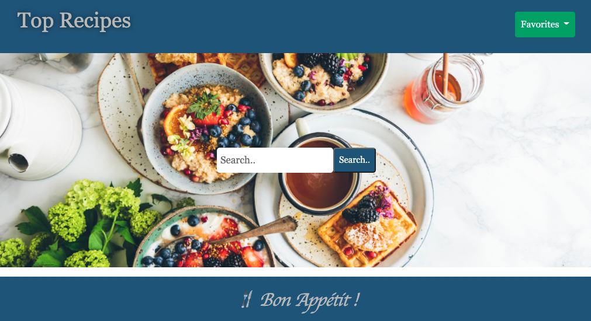
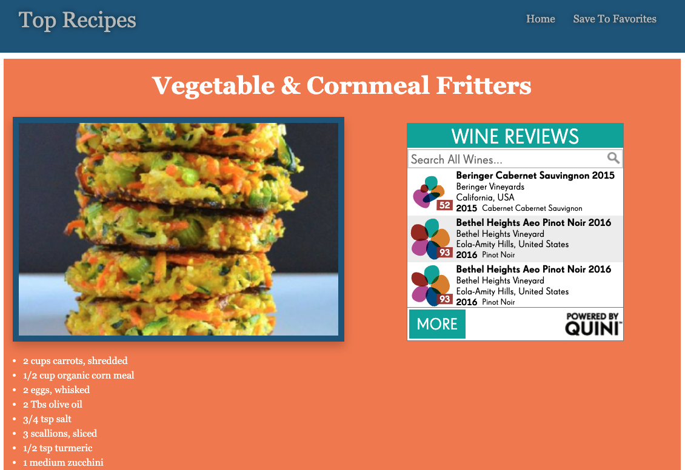

# Project1-Group3
## Top Recipes

## Purpose
A website that offers you a divers search of recipes allowing you to save your favorite recipes. 
Most of the recipes provides a wine pairing sugestion, you can use the wigdet to search for wines to complement your meal.

## Built With
* HTML
* CSS
* JavaScript
* BootStrap
* API.spoonacular.com & quiniwine.com/widget

## Demonstration 
The following images shows the full web page:

## Website link
[Top Recipes](https://andyp1223.github.io/Project1-Group3/)

## Refactors:
With the functionality of APIs through JavaScript, Top Recipes uses event listener to search for recipes.

Results are then displayed towards the bottom of the page giving you a variery of choices. Once you click on your choice it will take you to a second page where you will see the recipe instructions.

Second page gives you a list of ingridients, as well as cooking instructions and wine pairing for meals that apply. 

Quiniwine widget is a tool in place for your wine search.

## Contributor
* Christopher McCormack
* Andy Peralta
* Amos Han
* Yuri Ramirez